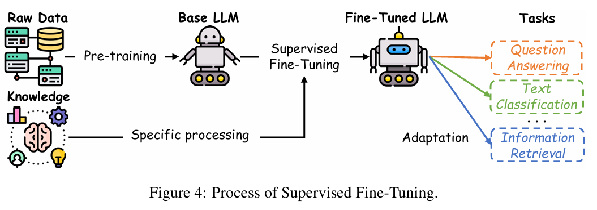
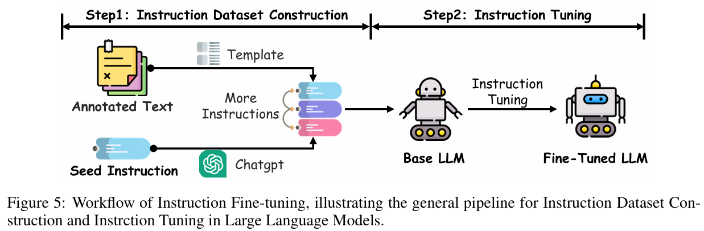

## 大模型后训练之微调
微调构成了使预先训练的大型语言模型 （LLM） 适应专业任务的基石，通过有针对性的参数调整来完善其功能。此过程利用标记或特定于任务的数据集来优化性能，从而弥合通用预训练和特定领域要求之间的差距。

### 三种主要的微调范式：
监督式微调，它使用带注释的数据集来提高特定于任务的准确性;

自适应微调，通过指令优化和基于提示的方法自定义模型行为;

强化微调，它集成了强化学习，以根据奖励信号迭代优化输出，通过动态交互促进持续改进。

### 监督式微调
监督微调 （SFT） 通过利用特定于任务的标记数据集，使预训练的 LLM 适应特定任务。与依赖于指令提示的指令调优不同，SFT 使用带标签的数据直接调整模型参数，从而产生既精确又符合上下文的模型，同时保留广泛的泛化功能。

### 关键点
#### 模型选择：
像 T5 这样的小型模型在数据集有限的资源受限环境中表现出色，而较大的模型，如 GPT-4，利用其卓越的能力在复杂、数据丰富的任务中表现出色。
#### 数据集准备
制作高质量的 SFT 数据集是一个多方面的过程，对于微调成功至关重要。

#### SFT流程
微调过程就从预训练的 LLM 开始，通常是通过对大规模原始数据集进行无监督或自监督的预训练获得的。这个预训练阶段的目标是获得适用于各种任务的一般特征表示。随后，在微调阶段，使用特定于任务的注释数据调整模型的参数，从而使模型与给定应用程序的要求保持一致

### 全参数微调
全参数微调是指调整预训练模型的所有参数的过程，而 LoRA 或 Prefix-tuning 等参数高效方法仅修改参数的子集。对于需要高精度的任务，例如医学和法律领域的任务，通常首选全参数调整，但它需要大量的计算开销。

### 自适应微调
自适应微调会修改预先训练模型的行为，以更好地满足用户特定需求并处理更广泛的任务。这种方法引入了额外的提示来指导模型的输出生成，为自定义模型的响应提供了一个灵活的框架。自适应微调中值得注意的方法包括指令调优和基于提示的调优，这两种方法都通过引入特定于任务的指导来显着增强 LLM 的适应性。

#### 指令微调
指令调优是一种通过在专门构建的指令数据集上微调基础 LLM 来优化基础 LLM 的技术。

这种方法大大提高了模型在各种任务和领域中泛化的能力，从而提高了其灵活性和准确性。
如图 5 所示，该过程首先将现有的 NLP 数据集（例如，用于文本分类、翻译和摘要的数据集）转换为自然语言指令，其中包括任务描述、输入示例、预期输出和说明性演示。

像 Self-Instruct这样的技术通过自动生成额外的指令-输出对，进一步增强了这些数据集的多样性，从而扩大了模型的暴露范围。
微调过程会调整模型的参数以与这些特定于任务的指令保持一致，从而使 LLM 在熟悉的任务和以前看不见的任务中都能稳健地执行。
例如，InstructGPT 和 GPT-4在各种应用程序中显示出指令跟踪能力的显着改进。

Instruction Tuning 的有效性在很大程度上取决于指令数据集的质量和广度。高质量的数据集应涵盖广泛的语言、领域和任务复杂性，以确保模型保持广泛适用。
此外，指令的清晰度和组织性在使模型能够有效地解释和执行任务方面起着关键作用。集成演示示例等技术，包括思维链提示，可以显著提高需要复杂推理的任务的性能。
此外，确保在微调阶段任务的平衡分配对于避免由于任务覆盖率不平衡而导致过度拟合或降低模型性能至关重要。
